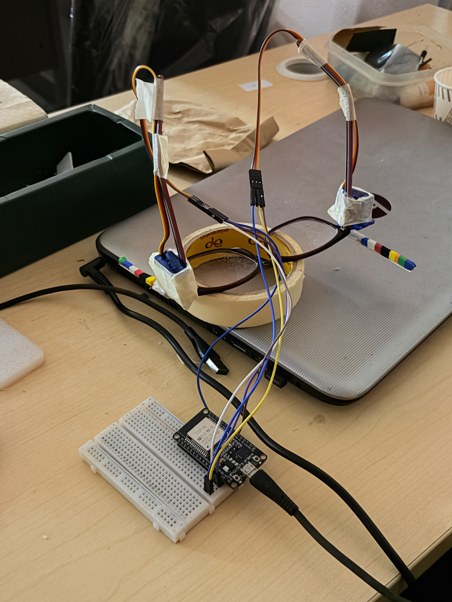
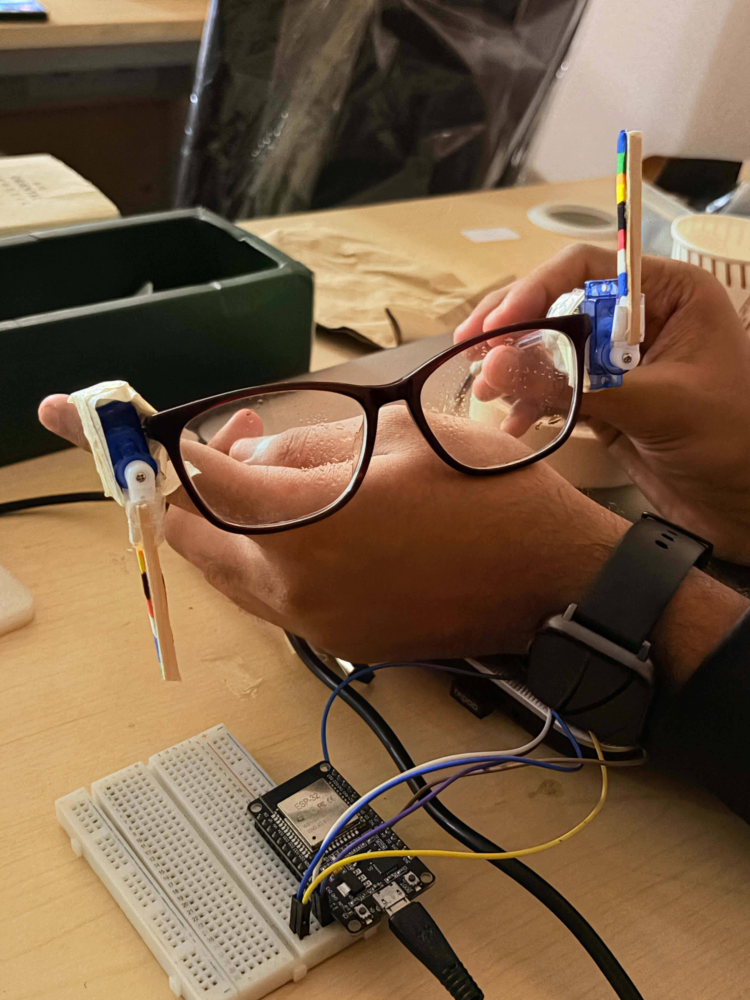
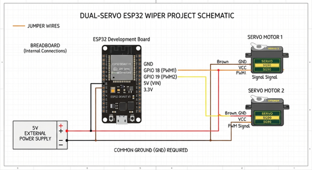
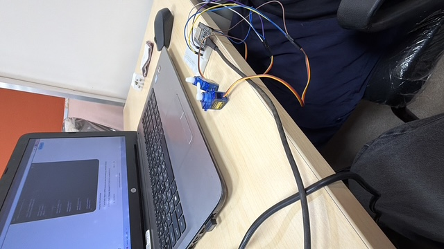
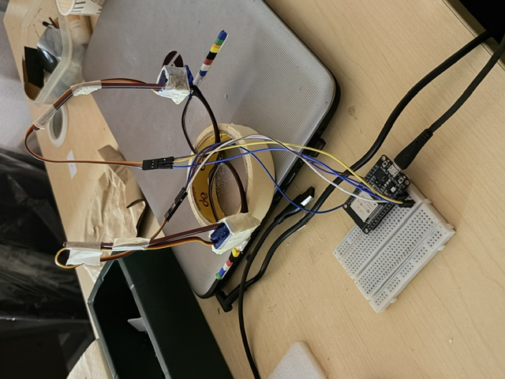

# Wiper For Glasses 🎯
Basic Details
Team Name: Pazham Pori
Team Members
Team Lead: Sreehari C - CETKR

Member 2: Pranav Das - CETKR

# Project Description
An automated, windshield-style motorized wiper system built directly onto a pair of eyeglasses, controlled wirelessly via an ESP32 web server to keep your lenses crystal clear from imaginary raindrops.

# The Problem (that doesn't exist)
Walking outside and having your glasses get smudged or rained on requires the immense physical labor of taking them off and wiping them with a microfiber cloth like a caveman. Furthermore, traditional glasses lack high-torque mechanical sweeping blades.

# The Solution (that nobody asked for)
We strapped two micro-servos and miniature wiper blades directly onto a pair of spectacles and hooked them up to an ESP32 access point. Now, you can wipe your lenses with the touch of a button on a web interface—ensuring maximum neck strain and zero visibility while operational!

Technical Details
Technologies/Components Used
For Software:

C++ (Arduino IDE)

ESP32 WebServer & WiFi Libraries

ESP32Servo Library

For Hardware:

ESP32 NodeMCU Development Board

2x Micro Servos (SG90)

Miniature Wiper Blades / Attachments

External Power Source / Battery

Connecting wires & Spectacle frame

Implementation
For Software:

Installation
Install the Arduino IDE.

Add the ESP32 board package to your Arduino IDE.

Install the ESP32Servo library via the Library Manager.

Upload the provided code to your ESP32 board.

Run
Power up the ESP32.

Connect your phone or computer to the Wi-Fi network: ESP32-Servo (Password: 12345678).

Open a browser and navigate to http://192.168.4.1.

Click START to trigger the automated wiper sequence or STOP to halt it.

Project Documentation
For Software:

# Screenshots (Add at least 3)

*Add caption explaining what this shows*

*Add caption explaining what this shows*

*Add caption explaining what this shows*

# Schematic & Circuit

# Build Photos

*List out all components shown*

*Explain the build steps*

### Project Demo
# Video

*Explain what the video demonstrates*

---
Made with ❤️ at TinkerHub Useless Projects 

